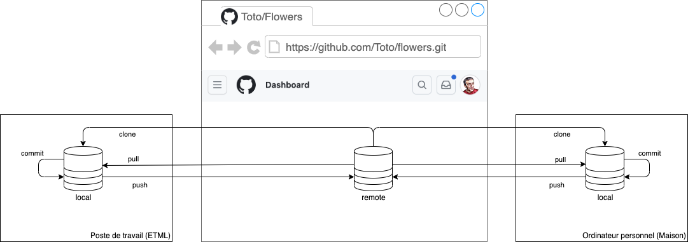
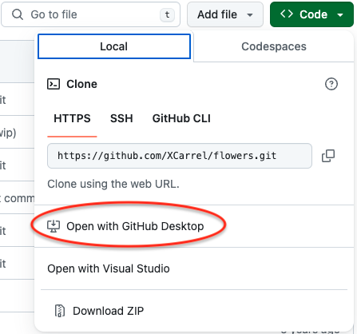
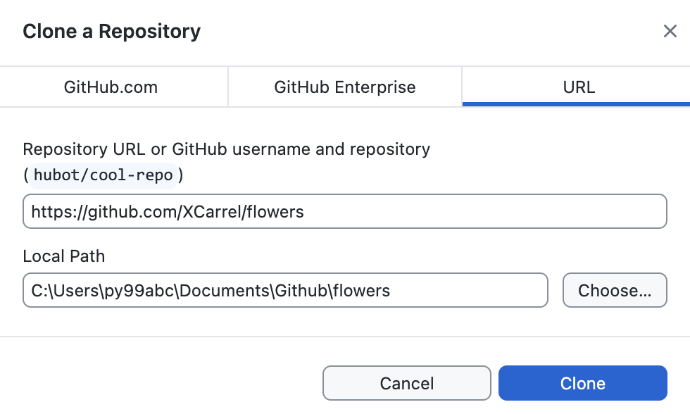

# Github
Ce document est une introduction à l’utilisation la plus simple qui soit de Git avec Github pour travailler seul à deux endroits distincts (au travail et à la maison).

## Repository
L’entité principale dans Git est le Repository (‘Dépôt’ en français), souvent abrégé ‘Repo’.  

Formellement, un repo Git est le dossier .git/ qui se trouve dans le dossier d'un projet. Ce dépôt suit toutes les modifications apportées aux fichiers de votre projet (dossier et sous-dossiers), en construisant un historique au fil du temps. Autrement dit, si vous supprimez le dossier .git/ vous supprimez l'historique de votre projet.  

Par abus de langage, on utilise souvent le terme de repo pour désigner l’ensemble formé du dossier de projet et du .git/ qu’il contient.

### Local vs Remote
Git est un système de gestion de version décentralisé. Cela veut dire qu’il peut exister de nombreuses copies du repo disséminées sur plusieurs machines.

Il y a une et une seule copie d’un repo qui existe sur Github : on la nomme ‘Remote’ (ou ‘origin’). Chaque copie du repo qui est faite sur une machine est un ‘repo local’ (à la machine en question).

Ce système donne beaucoup de flexibilité de travail. Son inconvénient est qu’il faut bien gérer la synchronisation entre le remote et les repos locaux car elle n'est pas automatique (et c'est bien!!!).

## Commandes
Les principales commandes qui vous permettront de commencer à travailler avec Github sont illustrées dans la figure que voici:

 

`clone` : crée un repo local à partir du repo remote.  
`pull` : met à jour le repo local à partir du remote  
`push` : met à jour le repo remote à partir du local  
`commit` : enregistre dans le repo tous les changements effectués dans le projet depuis le dernier `pull`, `commit` ou `clone`.

### Exemple d’utilisation
Sur mon poste de travail ETML et sur mon ordinateur personnel à la maison, j’ai installé Github Desktop et j’ai accès à Github.com.
1. Depuis l’ETML, je crée un nouveau repo sur Github. Je le nomme ‘flowers’. C’est le repo remote. (Il est très fortement recommandé de créer le repo avec un Readme)
2. Depuis le site Github.com, je lance l'opération de clonage avec Github Desktop:
      
    Je peux mettre le repo local où je veux sur mon poste, cela n'a pas d'importance.
    
  **Attention :** ne mettez pas vos repos locaux sur les lecteurs réseau. Cela ne sert à rien et ne peut que vous causer des problèmes.
1. Je travaille sur mon projet flowers dans le repo local: je crée du code, des documents, des images, ...
2. J’ai terminé une tâche : je fais un **commit**. Cela a pour effet d’enregistrer tout mon travail dans le repo local.
3. Je fais un **push**. Cela a pour effet de mettre à jour le remote sur Github.
4. Je continue à travailler. Je crée de nouveaux fichiers, dossiers, ... Je fais également certaines modifications à des fichiers que j’ai déjà commités/pushés précédemment.
1. J’ai terminé ma deuxième tâche : je fais un **commit**. Cela a pour effet d’enregistrer tout le travail que j’ai fait depuis le dernier commit dans le repo local.
1. Je fais un **push**. Cela a pour effet de mettre à jour le remote sur Github.
2. J’ai terminé ma journée, je rentre chez moi. Mais il y a encore une chose que j’aimerais bien terminer aujourd’hui...
3.  Arrivé chez moi, je clone le repo sur mon ordinateur personnel. L’état de mon projet est alors exactement le même que celui sur mon poste à l’ETML.
4.  Je fais cette fameuse chose que je voulais terminer dans le repo local de mon ordinateur.
5.  Quand j’ai terminé, je fais un **commit**. Cela a pour effet d’enregistrer mon travail dans le repo local sur mon ordinateur personnel.
6.  Je fais un **push**. Cela a pour effet de mettre à jour le remote sur Github.
7.  Le lendemain, j’arrive à l’ETML. Mon projet dans le repo local de mon poste de travail est en retard puisqu’il ne contient pas mon travail d’hier soir.

 8.  Je fais un **pull**. Mon repo local est maintenant à jour, je peux continuer à travailler sur ce poste.
8.  Je fais plusieurs **commit / push** pendant la journée.
9.  Le soir chez moi, c’est cette fois le repo local de mon ordi qui est en retard. Je fais **pull**, il est mis à jour et je peux continuer (ou pas).
    
## Conflits
Il est très important de faire **pull** quand on commence à travailler sur un poste et **push** quand on a fini. Ne pas le faire peut mener à des conflits difficiles à résoudre.

En effet, Git se rappelle de (presque) tout !

Admettons que j’aie un fichier ‘tulipe.png’ qui est à jour partout (remote, local ETML, local maison). Je le modifie à l’ETML et je fais commit / push. Le tulipe.png du local à la maison est en retard. Si j’oublie de faire pull à la maison, que je modifie le fichier et que je fais commit puis push, Github va refuser le push parce que mes modifications n’ont pas été faites sur la dernière version de tulipe.png.

## Nommage et contenu des commits
Pour profiter pleinement des avantages de l’outil, il convient de bien faire ses commits. Il y a deux pratiques fondamentales à suivre :

1. Faire des commits **atomiques**
2. Bien **nommer** les commits

Un commit atomique couvre entièrement et uniquement une tâche. Exemple : Vous devez ajouter une information à saisir dans un formulaire de l’application que vous développez. Cela implique de modifier plusieurs fichiers : MLD, script de base de données, formulaire, SQL. Faites un seul commit qui contient tous ces fichiers et rien que ces fichiers.

[Conventional Commits](https://www.conventionalcommits.org/en/v1.0.0/) est une convention très répandue pour bien nommer vos commits.  
En quelques mots, le nom est constitué de trois parties:

`type(scope): effet`

Le **type** décrit l’origine du changement. Il peut prendre différentes valeurs :

- **feat**: Ajout d’une nouvelle fonctionnalité;
- **fix**: Correction d’un bug;
- **build**: Changement lié au système de build ou qui concerne les dépendances (npm, grunt, gulp, webpack, etc.).
- **docs**: Ajout ou modification de documentation (README, JSdoc, etc.);
- **perf**: Amélioration des performances;
- **refactor**: Modification n’ajoutant pas de fonctionnalités ni de correction de bug (renommage d’une variable, suppression de code redondant, simplification du code, etc.);
- **test**: Ajout ou modification de tests;
- **revert**: Annulation d’un précédent commit;
- **chore**: Toute autre modification (mise à jour de version par exemple).
- **UI**: Modification de l'apparence de l'interface utilisateur (couleurs, police de caractères, etc.)
- **UX**: Modification du fonctionnement de l'interface utilisateur (remplacement de boutons par une liste déroulante, popup de validation, etc.)  
  
Cette liste n'est ni imposée, ni exhaustive. Elle est constitué selon les pratiques que l'on souhaite mettre en œuvre dans notre équipe.

Le **scope** (la portée en français) indique les composants de notre projet qui sont touchés par le commit. Il est facultatif.

L'**effet** décrit ce que fait le commit. Il s'agit là d'une phrase dans une forme active. Un bon moyen d’aide à sa formulation est de compléter l’une des deux phrases suivantes
1. « Si on l’applique, ce commit va ... »
2. « Si on applique ce commit, le système va ... »

Le nom de votre commit est ce que vous mettriez à la place des points de suspension.

Il peut arriver qu’un commit n’apporte rien de véritablement significatif : correction de fautes d’orthographe, mise en page, détail cosmétique, ... Dans ce cas, épargnez-vous la peine de trouver nom significatif et mettez un simple terme entre parenthèses : (orthographe), (cosmétique), ...

Exemples

| Nom | Explication |
|---|---|
|`chore: Move pictures to own folder` | Un comité qui déplace une série d'images dans un sous dossier |
| `chore(npm): Remove unused dependencies` | Ce commit supprime des références à des dépendances gérée par npm et dont on n'a plus besoin|
|`feat(user):Save user's birthdate`| Ce commit rajoute au site la possibilité d'enregistrer la date de naissance d'un utilisateur.|
|`doc(database):Change user-role relationship to n-m`|Ce commit contient une nouvelle version du MCD et du MLD dans laquelle  un utilisateur peut avoir plusieurs rôles|
|`fix(CRUD company):Store address in long text`| Résolution d'un problème dans la gestion des adresses de compagnies : on ne parvenait pas à saisir une adresse de plus de 20 caractères|
|`refactor(dates)Use moment.js`| Remplacement de calculs de date faits à la main par l'utilisation d'une librairie spécialisée dans la manipulation des dates|
|`(typos)`| Corrections de simples fautes de frappe sans aucune influence sur quoi que ce soit|
|`doc(Git):Add Conventional Naming to manual`| Ajoute une section qui explique le nommage des commits avec Git dans la documentation |