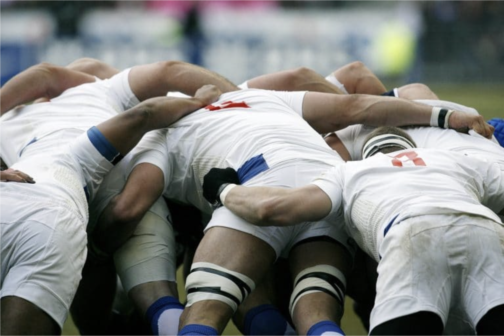

# Définition Scrum en moins de 10 minutes

<small>_Source axosoft (http://www.axosoft.com/)_</small>

Scrum est un framework de développement de produits complexes. Il est défini par ses créateurs comme un « cadre de travail holistique itératif qui se concentre sur les buts communs en livrant de manière productive et créative des produits de la plus grande valeur possible ». 

Pour mieux comprendre cette définition, précisons que :
- Le mot "holistique" signifie "Qui s'intéresse à son objet dans sa globalité". Appliqué à Scrum, cela veut dire que l'on s'intéresse à l'ensemble du contexte dans lequel notre projet se situe, pas juste au produit que l'on fabrique.
- Le mot "itératif" signifie "Qui se répète plusieurs fois"

## Répartition des rôles dans Scrum

### Le Scrum Master

- S’assure que les principes et les valeurs de Scrum sont respectés 
- Facilite la communication au sein de l’équipe
- Cherche à améliorer la productivité et le savoir faire de son équipe

### L’équipe

- Pas de rôle bien déterminé : architecte, développeur, testeur, ...
- Tous les membres de l’équipe apportent leur savoir faire pour accomplir les tâches. Taille de 6 à 10 personnes en général

### Le Product Owner

- Expert métier, définit les spécifications fonctionnelles
- Etablit la priorité des fonctionnalités à développer ou corriger. Valide les fonctionnalités développées
- Joue le rôle du client

## Les Artefacts

Un artefact est une chose qui est le résultat d'une activité humaine.  
On en reconnaît trois dans Scrum: le **product backlog**, le **sprint backlog** et l'**incrément**.

### Le product backlog

Le product backlog est constitué de l'ensemble des exigences du client. Il ne doit pas nécessairement contenir toutes les fonctionnalités attendues dès le début du projet, il va évoluer durant le projet en parallèle des besoins du client.  
Il est maintenu par ordre d'importance.

Note: Dans le cadre de ce module, il s'agit d'une liste de User Stories. Ceci est un choix de l'ETML, car Scrum ne dit pas sous quelle forme les exigences doivent être exprimées.

### Le sprint backlog

Le sprint Backlog est constitué des User Stories que l'équipe a sélectionnées pour être réalisées au cours du prochain sprint

### L'incrément

L'incrément est le résultat du travail réalisé au cours d'un sprint. On n'y intègre que ce qui a été fait dans le cadre des User Stories qui ont été validées durant la Sprint Review

## Les Evénements

### Le sprint

Le cycle de vie Scrum est rythmé par des itérations de quelques semaines: les sprints.

### Le Daily Scrum (la mêlée)

Au cours du sprint, il y a chaque jour une brève réunion d’avancement avec tous les membres de l’équipe.
Son but est de s'informer mutuellement de l'avancement personnel et éventuellement des problèmes rencontrés. Elle vise également à stimuler l’esprit travail en équipe et le niveau d’engagement de chaque membre de l’équipe dans le projet.  
Durant la réunion chaque membre de l’équipe doit prendre la parole et présenter :
- Ce que j’ai fait hier et les éventuels problèmes rencontrés
- Ce que je vais faire aujourd’hui
- Est ce que j’ai des difficultés pour continuer mon travail.

En faisant cet exercice quotidiennement chaque membre de l’équipe est au courant de ce que font ses collègues et il peut coordonner son travail et aider ou se faire aider en cas de difficultés.  
Le Daily Scrum Meeting n’est pas une réunion pendant laquelle on cherche à résoudre les problèmes, mais uniquement à les identifier et les exprimer. 

### La Sprint Review 
A la fin d’un sprint, on fait une démonstration au client des derniers développements. Ce dernier les valide (ou pas) et ils intègrent alors l'incrément.

### Le Sprint Planning

Cette réunion rassemble toute l'équipe. On y examine le contenu du Product Backlog et on sélectionne ensemble les Stories que l'on pense pouvoir réaliser au cours du sprint à venir

### La Sprint Retrospective  

De par ses valeurs, Scrum prône l’adaptabilité, sous l’effet de l’expérience acquise et des spécificités du projet.
Et donc en général juste après la Sprint Review, l'équipe prend le temps de faire un bilan sur son fonctionnement pour en tirer des points d’amélioration.  
 