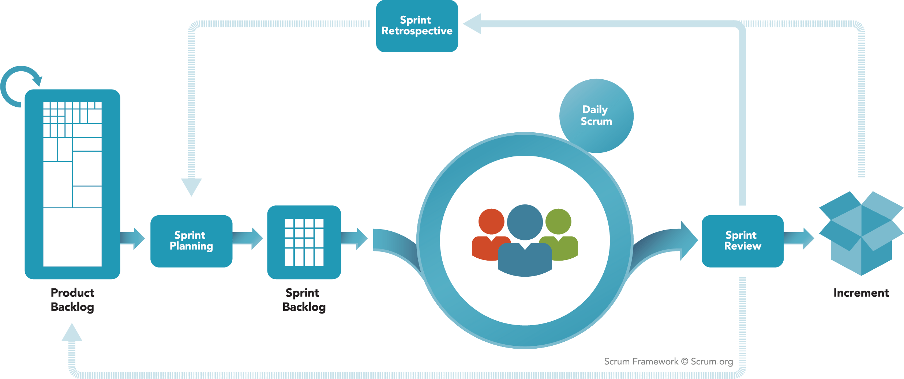

## Travail effectué, semaine du 23.1.2023

### Lundi 

- Revue du travail effectué [la semaine passée](Semaine1.md)
- Lecture "expliquée" du Scrum Guide
  - Présentation d'une vue graphique globale de scrum 
- Features
    - Ce sont les **fonctionnalités**, ce que fait (doit faire) le système
    - Pour nommer correctement une feature, il y a une technique: terminer la phrase "On utilise (le système) pour ...". La feature est ce qu'on met sur les points de suspension.
    - Exemple: je veux créer un nouveau smartphone que j'ai baptisé le X300. Quelles sont ses features ?
        - On utilise le X300 pour téléphoner  ==> feature: "Téléphoner"
        - On utilise le X300 pour enregistrer des sons  ==>  feature "Enregistrer des sons"
        - ...
    - Question: quelles sont les features de notre application Volscore ? Nous nous mettons d'accord sur la liste suivante
        - Marquer un match (points, remplacements, temps morts)
        - Gérer les matches (CRUD)
        - Afficher le résultat d'un match
    - Nous avons créé ces features dans IceScrum
- User Story
    - Chapitre Description de la [théorie simplifiée](../Supports/User%20Stories.pdf)
    - Nous avons créé des user stories dans la sandbox

### Jeudi 

- Revue de ce qui a été fait lundi, prise de connaissance du programme du jour
- Théorie sur les tests d'acceptance ([support](../Supports/User%20Stories.pdf)) 
- Mise en place de l'environnement de travail Volscore
  - UWamp
  - Chargement de la base de donnée avec [ce script](https://github.com/XCarrel/Volscore/blob/main/Volscore/Resources/volscore.sql)
  - VS 2022
- Mise en pratique: écriture de tests d'acceptance dans IceScrum
- Codage de user stories **validées**
- Période prévue pour le test la semaine prochaine (choix à la grande majorité): jeudi 12h20
